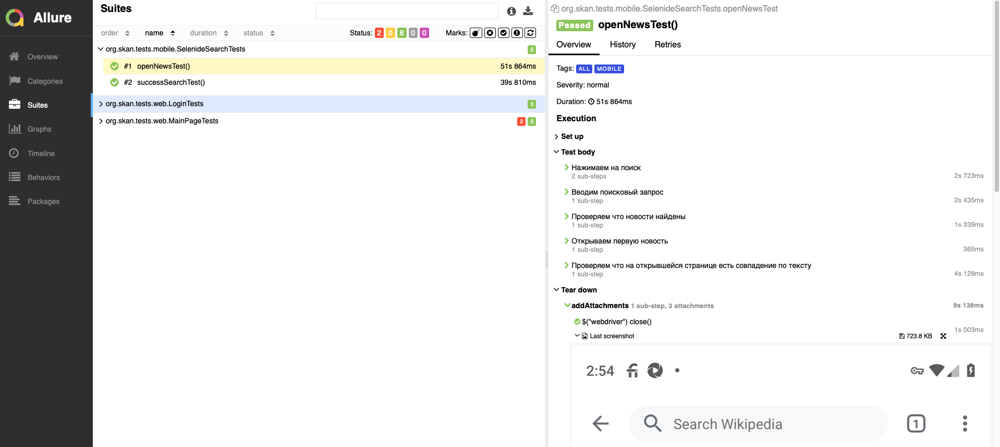

# Дипломный проект по автоматизации тестирования сайта https://ru.wikipedia.org

##	Содержание

- [Технологии и инструменты](#technologist-технологии-и-инструменты)
- [Тест кейсы](#bookmark_tabs-реализованные-проверки)
- [Запуск тестов из терминала](#computer-запуск-тестов-из-терминала)
- [Запуск тестов в Jenkins](#-запуск-тестов-в-jenkins)
- [Отчет о результатах тестирования в Allure Report](#-отчет-о-результатах-тестирования-в-Allure-report)
- [Интеграция с Allure TestOps](#-интеграция-с-allure-testops)
- [Уведомления в Telegram с использованием бота](#-уведомления-в-telegram-с-использованием-бота)


## Технологии и инструменты

<p  align="center">

<code></code>
<code></code>
<code></code>
<code></code>
<code></code>
<code></code>
<code></code>
<code></code>
<code></code>
<code></code>
<code></code>
<code></code>
<code></code>
<code></code>
<code></code>
</p>

В данном проекте автотесты написаны на **Java** с использованием фреймворка для тестирования **Selenide**. Для сборки проекта в среде **IntelliJ IDEA** используется **Gradle**.
**JUnit5** задействован в качестве фреймворка модульного тестирования. Запуск тестов выполняется из **Jenkins**. **Selenoid** используется для запуска браузеров в контейнерах **Docker**.

**Browserstack** используется для запуска мобильных тестов, для запуска на эмуляторе используются **Android Studio** и **Appium**. 

**Allure Report**, **AllureTestOps** и **Telegram Bot** используются для визуализации результатов тестирования.

## Тест кейсы

### Тест кейсы для UI тестирования

- Открытие главной страницы сайта 
- Поиск статьи 
- Открытие статьи
- Открытие страницы Форум
- Открытие страницы Пожертвовать
- Авторизация пользователя
- Открытие страницы Настройки
- Открытие страницы домашняя страница пользователя

### Тест кейсы для Mobie тестирования

- Поиск статьи
- Открытие статьи
- Добавление языка в настройках

## :computer: Запуск тестов из терминала

Файлы с параметрами конфигурации для запуска тестов находятся в папках resources/web и resources/mobile

### Локальный запуск тестов

```bash
gradle clean web
gradle clean mobile -DmobileDeviceHost=emulation
```

### Удаленный запуск тестов

```bash
gradle clean test
clean 
${TYPE}Tests
```

## Параметры сборки

<code>TYPE</code> – разновидность тестов (**web**, **mobile**, **all**).

##  Запуск тестов в [Jenkins](https://jenkins.autotests.cloud/job/wipedia_diploma/)

Для запуска сборки необходимо указать значениe параметрa TYPE (all, web, mobile) и нажать на кнопку <code><strong>*Собрать*</strong></code>.

<p align="center">
  
</p>

После выполнения сборки, в блоке <code><strong>*История сборок*</strong></code> напротив номера сборки появится
значок *Allure Report*, кликнув по которому, откроется страница с сформированным html-отчетом.

<p align="center">
  
</p>


##  Отчет о результатах тестирования в [Allure Report](https://jenkins.autotests.cloud/job/wipedia_diploma/8/allure)

<p align="center">
  
</p>
<p align="center">
  
</p>


##  Интеграция с [Allure TestOps](https://allure.autotests.cloud/jobrun/17723)

## Основной дашборд

<p align="center">
  
</p>
 
## Тест-кейсы 

<p align="center">
  
</p>

## [BROWSERSTACK](https://app-automate.browserstack.com/dashboard/v2/builds/2981d0ebfffee19fd6ef9896705e8277f4ae13f8/sessions/105dfdc7fd19eb2cede43893836364ca9bba6009)

<p align="center">
  
</p>

##  Уведомления в Telegram с использованием бота
После завершения сборки специальный бот, созданный в <code>Telegram</code>, автоматически обрабатывает и отправляет сообщение с отчетом о прогоне тестов.

<p align="center">

</p>

## <a name="Video"></a> :tv: Пример видео тестов в Browserstack

<p align="center">

</p>

